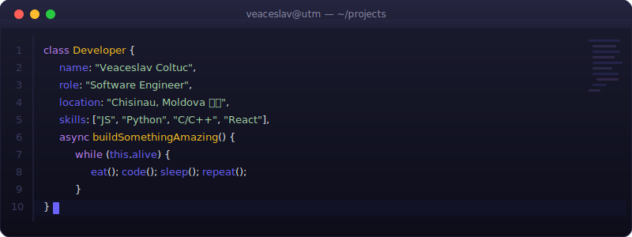

<!-- ╔══════════════════════════════════════════════════════════════════╗ -->
<!-- ║     🌌  WELCOME TO MY DIGITAL UNIVERSE  🌌                      ║ -->
<!-- ║     github.com/Helloguys3324 — Veaceslav Coltuc                ║ -->
<!-- ╚══════════════════════════════════════════════════════════════════╝ -->

<div align="center">

<!-- ═══════════════ ANIMATED HERO BANNER ═══════════════ -->
<a href="https://github.com/Helloguys3324">
  
</a>

<br/>

<!-- ═══════════════ ANIMATED TYPING EFFECT ═══════════════ -->
<a href="https://git.io/typing-svg">
  
</a>

<br/><br/>

<!-- ═══════════════ PROFILE BADGES ═══════════════ -->
<p>
  <a href="https://github.com/Helloguys3324">
    
  </a>
  &nbsp;
  <a href="https://github.com/Helloguys3324?tab=followers">
    
  </a>
  &nbsp;
  
  &nbsp;
  
</p>

<!-- ═══════════════ GITHUB SNAKE CONTRIBUTIONS ═══════════════ -->
<div align="center">
  <picture>
    <source media="(prefers-color-scheme: dark)" srcset="https://raw.githubusercontent.com/Helloguys3324/Helloguys3324/output/github-snake-dark.svg" />
    <source media="(prefers-color-scheme: light)" srcset="https://raw.githubusercontent.com/Helloguys3324/Helloguys3324/output/github-snake.svg" />
    
  </picture>
</div>

</div>

<!-- ═══════════════ DIVIDER ═══════════════ -->


<!-- ═══════════════ TERMINAL ANIMATION ═══════════════ -->
<div align="center">
  
</div>

<br/>

<!-- ═══════════════ DIVIDER ═══════════════ -->


<!-- ═══════════════ ABOUT ME ═══════════════ -->
##  &nbsp;About Me


```yaml
🧑‍💻 Name:       Veaceslav Coltuc
🎓 Education:  Software Engineering @ UTM
📍 Location:   Chisinau, Moldova 🇲🇩
🏆 Achievement: 3rd Place — Cloudflight Coding Contest (CCC)
🔭 Working on: Automation & Intelligent Web Apps
🌱 Learning:   Systems Programming & AI Infrastructure
⚡ Fun fact:   I build routing engines for my city for fun
```

<br clear="right"/>

<!-- ═══════════════ DIVIDER ═══════════════ -->


<!-- ═══════════════ TECH STACK ═══════════════ -->
## 🛠️ Tech Arsenal

<div align="center">

<table>
<tr>
<td align="center" width="33%">

### 👨‍💻 Languages
<br/>


</td>
<td align="center" width="33%">

### 🧩 Frameworks
<br/>


</td>
<td align="center" width="33%">

### ⚙️ DevOps & Tools
<br/>


</td>
</tr>
<tr>
<td align="center" colspan="3">

### 🗄️ Databases & Infrastructure
<br/>


</td>
</tr>
</table>

</div>

<!-- ═══════════════ DIVIDER ═══════════════ -->


<!-- ═══════════════ FEATURED PROJECTS ═══════════════ -->
## 🔥 Featured Projects

<div align="center">

<a href="https://github.com/Helloguys3324/-ChisinauRouting">
  
</a>
&nbsp;
<a href="https://github.com/Helloguys3324/vector_db_engine">
  
</a>

<a href="https://github.com/Helloguys3324/Site-for-managing">
  
</a>
&nbsp;
<a href="https://github.com/Helloguys3324/orchestratot">
  
</a>

</div>

<!-- ═══════════════ DIVIDER ═══════════════ -->


<!-- ═══════════════ GITHUB STATS ═══════════════ -->
## 📊 GitHub Analytics

<div align="center">


<br/><br/>


</div>

<!-- ═══════════════ DIVIDER ═══════════════ -->


<!-- ═══════════════ ACTIVITY GRAPH ═══════════════ -->
## 📈 Contribution Timeline

<div align="center">

[](https://github.com/ashutosh00710/github-readme-activity-graph)

</div>

<!-- ═══════════════ DIVIDER ═══════════════ -->


<!-- ═══════════════ CONNECT ═══════════════ -->
## 🤝 Let's Connect

<div align="center">

<a href="https://github.com/Helloguys3324">
  
</a>
&nbsp;
<a href="mailto:your.email@example.com">
  
</a>
&nbsp;
<a href="https://linkedin.com/in/veaceslav-coltuc">
  
</a>

<br/><br/>

<!-- ═══════════════ QUOTE ═══════════════ -->

```
 ╔═══════════════════════════════════════════════════════════════════╗
 ║                                                                   ║
 ║   "First, solve the problem. Then, write the code."               ║
 ║                                          — John Johnson           ║
 ║                                                                   ║
 ╚═══════════════════════════════════════════════════════════════════╝
```

<br/>

<!-- ═══════════════ FOOTER ═══════════════ -->


</div>
